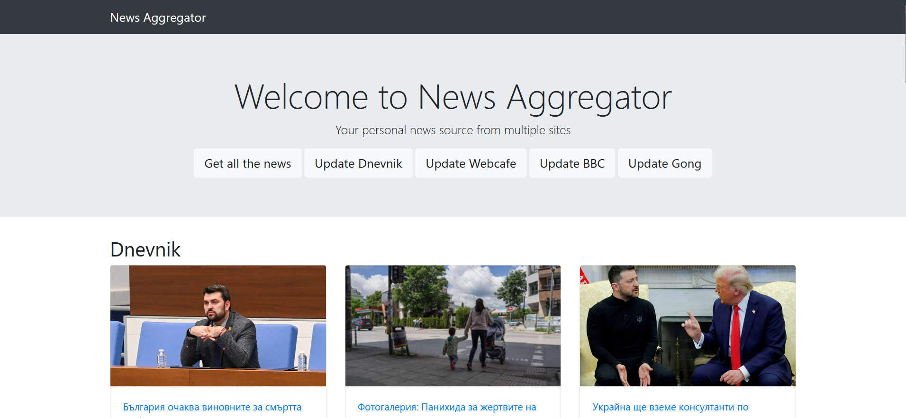

# 📰 News Aggregator



> An automated news aggregator built with Django and Selenium that collects and presents news from various Bulgarian and international sources in one place.

[](https://www.djangoproject.com/)
[](https://www.python.org/)
[](https://opensource.org/licenses/MIT)

## 🌟 Overview

The News Aggregator is a web application that automatically scrapes news from multiple sources and presents them in a unified, user-friendly interface. It demonstrates the use of web scraping techniques, Django web framework, and responsive design principles.

## ✨ Key Features

### 📱 Supported Sources
| Source | Content Type | Language |
|----------|----------------|------|
| Dnevnik.bg | Bulgarian News | 🇧🇬 BG |
| Webcafe.bg | Articles & Analysis | 🇧🇬 BG |
| BBC.com | International News | 🇬🇧 EN |
| Gong.bg | Sports News | 🇧🇬 BG |

### 🚀 Functionality
- ⚡ Parallel news extraction for better performance
- 🔄 Individual updates by source
- 📱 Responsive design with Bootstrap
- 🔌 Modular architecture for easy addition of new sources
- 🗄️ PostgreSQL database
- 🎨 Clean and intuitive interface

## 🏗️ Project Architecture

```
news_aggregator/
├── 📄 manage.py
├── 📋 requirements.txt
├── 📚 DOCUMENTATION.md
├── 📁 news_aggregator/
│   ├── ⚙️ settings.py
│   ├── 🔗 urls.py
│   └── 🌐 wsgi.py
├── 📁 news/
│   ├── 📊 models.py
│   ├── 👀 views.py
│   ├── 🔗 urls.py
│   └── 📁 scrapers/
│       ├── 🔧 base_scraper.py
│       ├── 📰 dnevnik_scraper.py
│       ├── 📰 webcafe_scraper.py
│       ├── 📰 bbc_scraper.py
│       └── 📰 gong_scraper.py
└── 📁 templates/
    └── 📁 news/
        └── 🎨 home.html
```

### 🔑 Key Components
- `📊 models.py`: Data structure for news articles
- `👀 views.py`: Core logic and controllers
- `🔧 scrapers/`: Modules for extracting data from each source
- `🎨 templates/`: Visualization templates

## 🛠️ Technologies Used

- 
- 
- 
- 
- 
- 
- 

## 🚀 Installation and Setup

### 1️⃣ Clone the Repository
```bash
git clone <repository-url>
cd news-aggregator
```

### 2️⃣ Create a Virtual Environment
```bash
python -m venv venv
source venv/bin/activate  # For Windows: venv\Scripts\activate
```

### 3️⃣ Install Dependencies
```bash
pip install -r requirements.txt
```

### 4️⃣ Database Setup
- Ensure PostgreSQL is installed and running
- Update settings in `settings.py` if needed
- Run migrations:
```bash
python manage.py migrate
```

### 5️⃣ Start the Server
```bash
python manage.py runserver
```

## 📖 Usage

1. Open `http://localhost:8000` in your browser
2. Choose an update method:
   - "Get All News" for all sources
   - Use buttons for specific sources
3. Browse news by categories
4. Click on a headline to read the full article

## 🧪 Testing

The project includes a comprehensive test suite covering unit tests, integration tests, and end-to-end tests.

```bash
# Run all tests
python manage.py test

# Run with coverage
coverage run manage.py test
coverage report
```

## 🔮 Future Enhancements

1. **Error Handling and Logging**
   - Comprehensive error handling system
   - Logging system for debugging

2. **UI/UX Improvements**
   - Advanced filtering options
   - Search functionality
   - User preferences

3. **Performance Optimization**
   - Caching implementation
   - Database query optimization

## 📚 Documentation

For more detailed information about the project's architecture, implementation details, and contribution guidelines, please refer to `DOCUMENTATION.md`.

## 📄 License

This project is licensed under the [MIT License](LICENSE) - see the LICENSE file for details.
